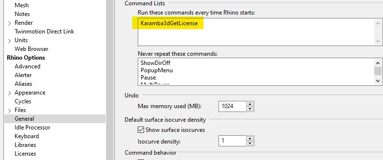
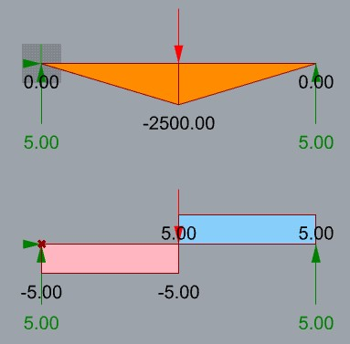
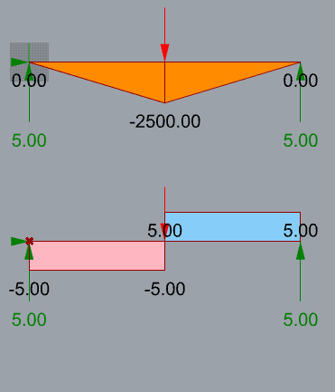
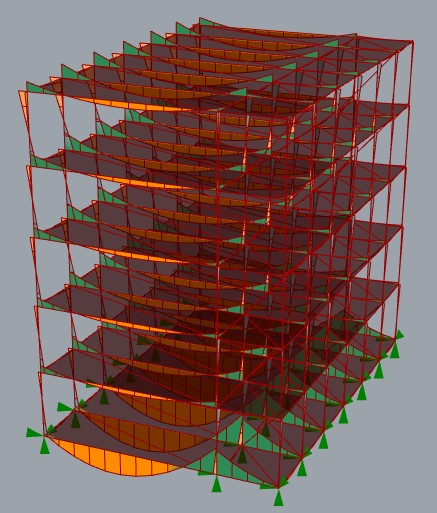
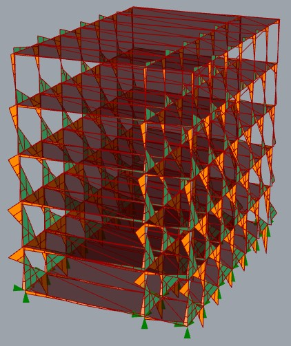
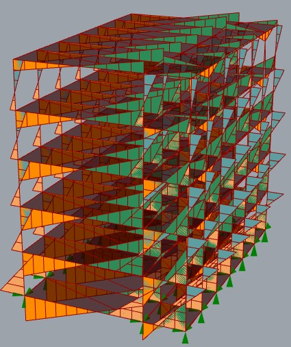
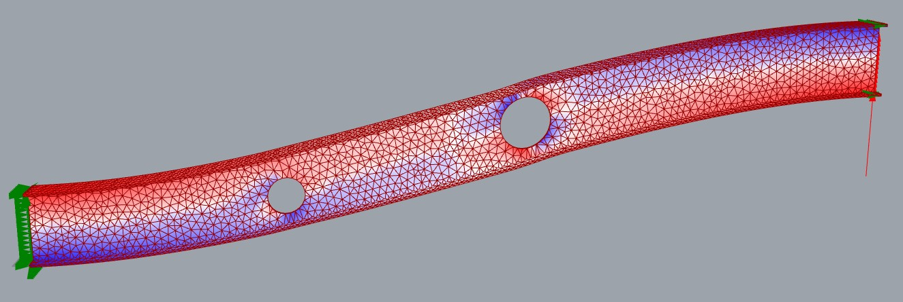
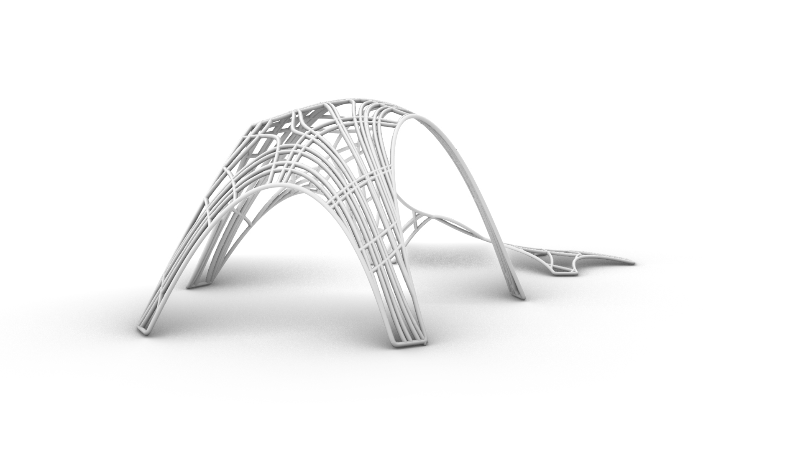

# Day1

1 日目は Rhino, Grasshopper, Karamba3D の基本的な操作を初めに紹介します。
それらを使った簡単な建物のモデル化とパラメトリックな構造解析を行い、最終日に製作する構造物の参考を一緒に作成していきます。

## はじめに

- 本ワークショップの内容の紹介
  - ルートレベルの Readme の内容について
  - 本ワークショップは私によるレクチャーや大学で行われる講義ではなく、皆さんと行うワークショップです。
    - 私が一人で話すだけではなく参加者とのインタラクティブを期待します。
    - 非常にアドバンストな内容についてもふれることがあるため、途中でわからなくなることがあるかもしれませんが適宜質問してください。わからないのはあなただけではないです。
  - 最終的な製作物については、パビリオンや東屋のような小さな構造物の作成を想定しています。
    - しかし建築系ではない方も参加されているので、必ずしもその限りではないです。
    - 最終日に参加者それぞれが製作物のプレゼンテーションをしていただきます。
    - 自分の専門性の中で本ワークショップの内容を活かした何かを製作してください。
- 参加者の自己紹介
  - 本ワークショップは Youtube でも配信することを想定していますが、こういった個人に関する情報はアーカイブで削除します。
  - スキルレベルの確認もしたいのでその点も話してください。
    - 構造力学、構造解析、構造設計などのレベル
    - Rhino、GH、Karamba3d の経験、レベル
    - プログラミングの経験、C#、Python の経験

## Rhino について

[公式サイト](https://www.rhino3d.co.jp/)より

> Rhino があればカタチを作り、編集し、解析、図面やレンダリング画像、アニメーションの作成、そして形状や次数、大きさの制約なしに NURBS カーブ、サーフェス、ソリッドを変換することができます。
> Rhino が生み出す自由形状の 3 次元モデリングは、あなたのイメージを正確にカタチにします。使われる分野も自由様々。工業デザインはもちろん、機械設計、金型設計、試作、製造、建築、宝飾、マルチメディア、FEM・CFD 等解析など、Rhino は使う人や分野を制約することはありません。

NURBS を扱うソフトであることが特徴です。
以下の記事がわかりやすいです。

- [NURBS とは？](https://www.rhino3d.com/jp/features/nurbs/)
- [ビギナーのための曲面モデリングセミナー Top](https://www.applicraft.com/tips/rhinoceros/series_beginner/)

Rhinoceros は UI で各機能をつかうことができますが、例えば AutoCAD のようにコマンドを使って機能を使うこともできます。
コマンドは英語で構成されているので、私は英語版の Rhino を使っています、注意してください。

Rhino では以下の形状を表すワードが出てきます。関係性を理解していると Grasshopper などで扱うときに理解が深まります。

- Curve
  - 線です。曲線や直線、円弧も含まれます。
  - line liked curve, Poly line, nurbs curve など全ては Curve です。
  - line は Curve ではありません。
- Surface
  - 面です。メッシュとの違いは、数式で表現されるものだということです。
  - Surface から Mesh を作成することはできます。
  - 逆に、Mesh 化すると数式表現を失うので、Mesh から Surface を作成することは基本的には困難です。
- Mesh
  - こちらも面ですが、Surface との違いは、点（Vertex）と線（Edge）と面（Face）で構成されます。
  - Rhinoceros では 3 点のメッシュと 4 点のメッシュの 2 つを扱うことができます。
  - 有限要素法に慣れている方は、シェル要素のような点から作られる面だと思っていただいても良いです。
- SubD(SubDivision)
  - メッシュをベースとして滑らかな面を構成するものです。
  - Rhinoceros では SubDDisplayToggle を使うとベースとなるメッシュと滑らかな面の表示を切り替えることができます。
- Brep(BoundaryRepresentation)
  - Brep はその単語の通り、境界を表現するものです。
  - 複数のサーフェスが集まったものだと考えてください。
- BooleanOperations
  - ブーリアン演算は、複数の形状を和、差、積といった集合演算により組み合わせ、合成された形状を作る演算です。
  - [wikipedia](https://ja.wikipedia.org/wiki/%E3%83%96%E3%83%BC%E3%83%AA%E3%82%A2%E3%83%B3%E6%BC%94%E7%AE%97)
- Intersect
  - 交差計算です。線と線、線と面、面と面など上記であげたもの同士の交差計算ができます。

## Grasshopper について

日本の代理店である [Applicraft 社のページ](https://www.applicraft.com/products/rhinoceros/grasshopper/)より引用

> 特徴１：マンパワーでは不可能な大量のデータ処理が可能  
> 特徴２：自由曲面を含む 3 次元形状をアルゴリズムにより生成
>
> Grasshopper は Rhinoceros 上で動作するプラグインのモデリング支援ツールです。
> 膨大な量のシミュレーションが行え、従来の発想方法では不可能だったアイデア領域の拡大、効率化、意思決定を桁違いのレベルで行うことを実現します。
> プロダクトデザイン、建築、ジュエリーデザインなど様々な分野で使用されています。

ノードベースのプログラミング言語とも言われたりします。

特に特徴的なのが DataTree です。
慣れないと全然うまくデータを扱うことができません。
プログラミングに慣れている方は Grasshopper で for 文のように要素に対して繰返し作業をしたくなることがあると思いますが、基本的には for 文のような機能はありません。
別の方法で実現する手段が DataTree だと考えてください。

//TODO: DataTree の例を作る

以下の動画が英語ですがわかりやすいので、より勉強したい方は見ることをおススメします。

- [The deal with Data Trees](https://www.youtube.com/watch?v=ob3ER12ut3Y)

より Grasshopper について詳しくなりたい方は以下の本をおススメします。
本ワークショップは Grasshopper そのものの機能を使った形の作り方はあまり触れないません。
この本は、たくさんの作例があり Grasshopper のスキルアップにとても良いです。

- [Parametric Design with Grasshopper 増補改訂版建築／プロダクトのための、Grasshopper クックブック](http://www.bnn.co.jp/books/9532/)

## Karamba3d について

Grasshopper 上で動く構造解析のプラグインです。
内部的には C++で書かれたソルバーが動作しており解析の高速さに重きを置いたプラグインです。

### ライセンス

Karamba3d には 4 つのライセンス形式があります。

1. Free
1. Full
1. PRO
1. EDU/LAB

- 詳細：https://manual.karamba3d.com/1-introduction/1.2-licenses

本ワークショップでは Full を除く全てのバージョンが対象です。
ですが、Free 版は一部機能制限があります。
Free 版でできない機能については説明しますので、その際は見ていていください。

もし有料版の Karamba3d(PRO, EDU, LAB) を購入されている場合、Grasshopper を起動する前に Rhinoceros のコマンドで `Karamba3DGetLicense` を実行することで Zoo からライセンスを取得することができます。
Grasshopper 起動後にライセンスを取得しても反映されないので注意してください。

毎回コマンドを打つことが手間、または忘れがちな場合は `Options` コマンドを使って Rhinoceros のオプションで General から Command Lists の部分に該当のコマンドを入れると Rhino を起動したときに自動で入力したコマンドが実行されます。

### 単純な架構の解析

はじめに大学の静力学の授業でやるであろう片端ピン、片端ローラーの単純梁の解析を行います。
一緒に操作していってください。

**なお、Karamba3dでの単位はmmにして使用しています。注意してください。**

参考のデータは simple-beam.gh です。

反力と最大モーメントの理論値は以下

$$
R_A = \frac{Pb}{L}, R_B = \frac{Pa}{L}, M_c = \frac{Pab}{L},
L = a + b
$$

梁の中央に荷重がかかる場合は以下

$$ R = \frac{P}{2}, M = \frac{PL}{4}$$

例えば梁長 1000mm、荷重 10N で中央に荷重をかけたとすると結果は以下

$$ R = 5, M = 2500 $$

Karamba3d の解析結果は以下となり、当然ですがあっていることがわかります。

解析自体は他のソフトでもできるけれど Grasshopper の特徴として、スライダーを使ってパラメトリックに荷重位置を動かすことができます。

簡単な例ですが、複雑な架構に対して同様にパラメトリックに構造解析を実行できることが Grasshopper 上で解析できる利点です。

### 骨組みの解析

ビルのような建物も解析することができます。
参考データは Grasshopper フォルダの building.gh です。
時間に余裕があれば作り方について解説しますが、時間がなければ省略します。

こういった形で建物に対して荷重ケースを分けて解析することも可能です。
以下の応力図は長期荷重、地震 X、地震 Y の荷重ケースの応力図です。

### サーフェスの解析

豊島美術館のようなシェルの構造解析、構造最適化も Karamba3d を使うことで行うことができます。
それについては 2 日目、3 日目でふれる内容になりますので、ここでは特定の部材そのものの構造解析についてもふれることを想定し設備ダクトなどを通すために梁に開けられる梁貫通孔を Karamba3d を使って考えてみます。

参考のデータは Grasshopper フォルダの hari-kantsu.gh です。

一般的な梁貫通基準は以下

- 貫通孔の内径寸法は梁せいの 1/2 以下
- 貫通孔間隔は両側の貫通孔径の平均の 3 倍以上
- 貫通孔位置は外法から 100mm 以上

以下は貫通孔補強メーカーの例ですが、貫通孔のイメージをつかむために参照しています

- http://www.j-fab.co.jp/common/pdf/technology/lineup/eg_ring.pdf

構造設計の実務に近い話でなじみのない方はピンとこないと思いますが、現場ではたくさん梁貫通が発生します。
もちろん基準図を守っていれば基本的には良いのですがそれ以上のこと、例えば実際の応力や変形の状態について考えたことありますか。
パラメトリックに梁貫通して部材がどうなるかみましょう。

こういったパラメトリックな構造解析を使うことで初めて現実的な時間で検討することができることを研究して最終日に発表していただいても構いません。
この WS で学んだことの実践を発表していただければと考えています。

### WS のサムネイルに使っていた建物例

こちらは平板を作成して一度解析し、その主応力線から梁を作成したものです。
この手法はパビリオンの作成などで使われる場合があります。

面の主応力方向つまり最大応力発生方向にそれを処理する部材は設けているため、これも一種の構造最適化と考えることができます。
ですが、本例は大変形解析した結果の変位スケール 1 倍の形状から作成しているわけではないので、厳密にはこの主応力から作成したラインにどの程構造的合理性があるかはわかりません。

参考のデータは Grasshopper フォルダの ShapeFromDeformationShall.gh です。

## 質疑応答コーナー

本日の内容は以上です。
質疑などありますか？
