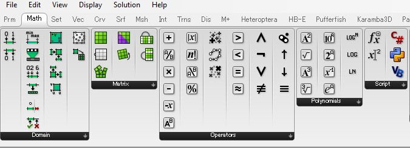
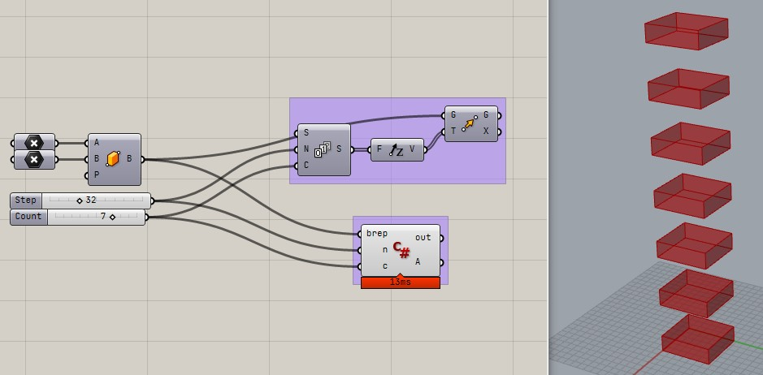
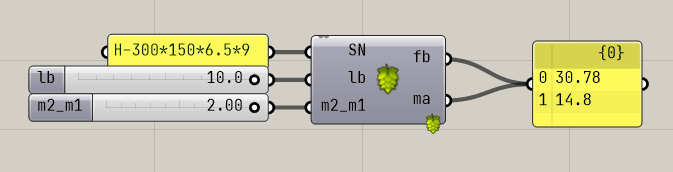
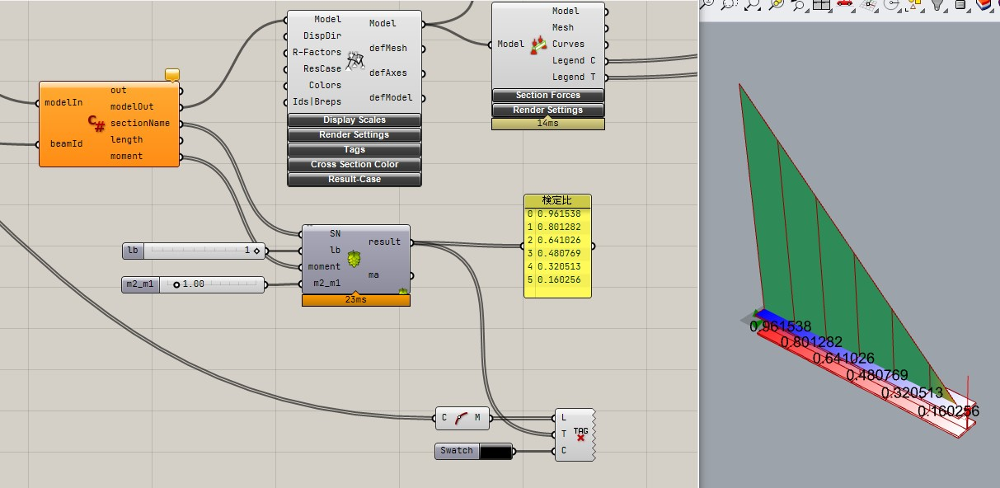

# Day2

2 日目はプログラミング言語の C#の基礎的知識と Grasshopper でのカスタムコンポーネントの作成について紹介します。
Karamba3D はユーロコードを基にしているため、C# を使って Karamba3D をカスタマイズすることにより日本での構造設計に即したパラメトリックな構造解析を可能にします。

## C# の基礎

環境構築がうまくいかないず手間取ることもあるので、以下のブラウザ上で C# を実行できるサービス [.NET Fiddle](https://dotnetfiddle.net/) を使って基礎について振れていきます。

### Hello World をする

まずプログラム言語を始める際のおなじみの Hello World の仕方は以下になります。https://dotnetfiddle.net/Ppx2zf

例えば Python や他の言語のように単純に文字列を出力する文だけでは C# は動きません。
そういった言語に慣れている方は少し冗長に感じるかもしれませんが、以下のようにクラスやメソッドを定義することで動作します。

```cs
// 最初に使用するライブラリを宣言します。
using System;

// class というキーワードを使ってクラスを定義します。
// class C# ではとても重要な概念です。
public class Program
{
  // class の中に、何かの動作を定義します。
  // これを メソッド と言います。
  public static void Main()
  {
    Console.WriteLine("Hello World!");
  }
}
```

### 型について

C# は静的型付け言語なので、変数には Python と異なり型を指定する必要があります。https://dotnetfiddle.net/5yW1jS

なぜ型を指定する必要があるかというと、開発における安全性を高めるためです。
プログラミングといっても文字を書いているだけです。
どの文字にどのような型が割り当てられるかは、型を付けなければすぐにはわかりません。
例えば数値型に文字列を入れてしまうとエラーで止まってしまいます。
そういったことをなくし安全に開発するために型を付けることが重要です。

```cs
using System;

public class Program
{
  public static void Main()
  {
    // 整数型 int
    int ia = 2;
    int ib = 5;
    int ic = ia + ib;
    Console.WriteLine("整数型 int");
    Console.WriteLine(ic);

    // 倍精度浮動小数点型 double
    // 小数点以下の値を持つ数値を扱える。
    // 単精度浮動小数点もあるが、こちらを使う場合が多い
    double da = 20.2;
    double db = 10.3;
    double dc = da + db;
    Console.WriteLine("倍精度浮動小数点型 double");
    Console.WriteLine(dc);

    // 文字列型 string
    // 文字列は ""（ダブルコーテーション）で囲う
    // 文字列の足し算もできる
    string sa = "hello ";
    string sb = "world";
    string sc = sa + sb + "!!!";
    Console.WriteLine("文字列型 String");
    Console.WriteLine(sc);

    // var 型推論
    // 型を推論するために使用される
    // 以下のように型を書かなくてもコンパイラが自動的に推論してくれます。
    var intNum = 10;
    var doubleNum = 10.2;
    var str = "hello";
  }
}
```

### if, for, while, foreach

if や for など他の言語でもよく使われる構文も備えています。https://dotnetfiddle.net/aN45Me

上から順番で処理していくので、中間の `else if` 判定の値は入力上は `a>=5` のみですが、文字で書いてある通りここで条件に合致するものは 5 以上、10 以下になります。
それはすでにその上の段階で 10 より大きいものは判定済みだからです。

```cs
using System;

public class Program
{
  public static void Main()
  {
    int a = 10;

    if (a > 10)
    {
      Console.WriteLine("入力は10より大きいです。");
    }
    else if (a >= 5)
    {
      Console.WriteLine("入力は5以上、10以下です。");
    }
    else
    {
      Console.WriteLine("入力は5未満です。");
    }
  }
}
```

上の例では単純に 1 回の処理でしたが、データの配列を作成して各値に対して判定してみます。https://dotnetfiddle.net/MRayoA

判定する箇所をメソッド化し、for 文を使って配列の長さ分の処理を行っています。
配列は値の集まりです。

```cs
using System;

public class Program
{
  public static void Main()
  {
    var values = new double[]{ 1.0, 10, 3.3, 10.2, 4 };

    for(var i = 0; i < values.Length; i++)
    {
      // このようにメソッド化することで、ひとまとまりの処理が一体何をしているのかわかりやすくなります。
      // Check Value → 値をチェックしているんだということがわかりやすい
      CheckValue(values[i]);
    }
  }

  public static void CheckValue(double num)
  {
    if (num > 10)
    {
      Console.WriteLine("入力: " + num + " は10より大きいです。");
    }
    else if (num >= 5)
    {
      Console.WriteLine("入力: " + num + " は5以上、10以下です。");
    }
    else
    {
      Console.WriteLine("入力: " + num + " は5未満です。");
    }
  }
}
```

こういった処理は while 文や foreach 文でも書くことができます。
興味がある方は以下のリンクより見てください。

- while での書き方：https://dotnetfiddle.net/PdZqoW
- foreach での書き方：https://dotnetfiddle.net/A3zEEs

### OOP について

C# はオブジェクト指向の言語と言われています。
オブジェクト指向(Object Oriented Programing, OOP)は何でしょうか。
ググるとオブジェクト指向の三大要素として以下が出てきます。

1. 継承
2. カプセル化
3. 多態性（ポリモーフィズム）

興味がある方は調べてみてください。
大きなコードを書くときにこれを意識するとより安全で良いコードがかけるようになります。

これは OOP に対する説明として必ずしも正しくありませんが、上記でやったように機能を適切に分割してメソッドやクラスの塊にして実装していくことだと現段階では考えてください。

## Grasshopper コンポーネントのカスタムコンポーネント

ここまでの C# は、ウェブのサービス上で実行してきましたが、Grasshopper でも C# を使ってコンポーネントを作成することができます。

Math タブの Script の箇所にコンポーネントが存在し、以下の 3 言語が公式でサポートされています。

- C#
- IronPython
  - 通常の Python とは少し違います
- VB.NET



ここでは C# を使って、Grasshopper コンポーネントを作成していきます。
以下のように通常のコンポーネントで簡単にできる Brep を move させることをコードで書いていきます。



各コードの内容は以下です。
Grasshopper でコンポーネントをどう使ってやりたい操作を実現するかいくつか方法があるのと同様に、コードでの書き方にもいくつか方法があります。

```cs
private void RunScript(Brep brep, double n, int c, ref object A)
{
  var result = new List<Brep>();
  for(var i = 0;i < c; i++)
  {
    Brep dupBrep = brep.DuplicateBrep();
    result.Add(dupBrep);
    brep.Translate(0, 0, n);
  }

  A = result;
}
```

プログラミング言語から、Grasshopper を操作するにはどのような機能が提供されているか確認する必要があります。
mcneel から API(Application Programming Interface) が公開されており、それを見ながら機能を確認し実装していきます。
Grasshopper そのものの機能を使うことは少ないので、基本的には RhinoCommon を使っていきます。

- [RhinoCommon API](https://developer.rhino3d.com/api/RhinoCommon/html/R_Project_RhinoCommon.htm)
- [Grasshopper API](https://developer.rhino3d.com/api/grasshopper/html/723c01da-9986-4db2-8f53-6f3a7494df75.htm)

## Karamba3D のカスタマイズ

上記でやったカスタムコンポーネントをさらに発展させることで、Karamba3d をカスタムすることができます。
カスタマイズで参照する Karamba3d の API は以下になります。

- https://www.karamba3d.com/help/2-2-0/html/b2fe4d67-e7e2-4f96-bc84-ecd423bde1a7.htm

### 柱の解析

#### Grasshopper でコンポーネントを使ってモデルづくり

最初から Karamba3d を使ったコーディングをするとわかりづらいので、はじめにコンポーネントを使ってモデリングしていきます。
作るものの条件は以下です。

- 断面形状：角型 30cm x 30cm 板厚 2.2cm
- 材料：鋼材、色を赤にする
- 境界条件：下端固定
- 荷重：上端節点に対して、-Z 方向に 10kN
- 部材長：3m
- 部材の ID：Column

こんな形です。完成したデータは grasshopper フォルダの column_model.gh です。


#### 同じものを C#Script コンポーネントで作る

スクリプトで Karamba3d を使うためには、KarambaCommon.dll と Karamba.gha を使います。
これは Karamba3d がインストールされたフォルダ内にあります。
Karamba3d はデフォルトだと以下にあります。
以下のフォルダには KarambaCommon.dll とは別に Karamba.dll がありますが、こちらは C++ で書かれた Karamba3d の構造計算を実際に行っている部分になります。

> C:\Program Files\Rhino7\Plug-ins\Karamba\karambaCommon.dll

これだけだとどんなクラスがあるかわからないので、冒頭で上げた SDK を見ていきます。

基本的にはメソッドへの入力と出力がコンポーネントの入出力ほぼ同じ構成になっています。では先程作ったモデルを KarambaSDK を使って作成していきます。

最初に参照を追加します。C# Script コンポーネントを右クリックして Manage Assemblies... を選択して、その後 Referenced Assemblies の右側の Add から KarambaCommon.dll と Karamba.gha を追加します。


#### C#Script の内容

完成したデータは grasshopper フォルダの column_script.gh です。

注意点ですが、以下のコード中でコメントアウトしているように単位がものによってまちまちなため注意してください。

```cs
using System.Drawing;
using System.Linq;
using Karamba.Utilities;
using Karamba.Elements;
using Karamba.Geometry;
using Karamba.CrossSections;
using Karamba.Supports;
using Karamba.Materials;
using Karamba.Loads;
using Karamba.Models;

public class Script_Instance : GH_ScriptInstance
{
    private void RunScript(ref object modelOut, ref object maxDisp)
    {
      var logger = new MessageLogger();
      var k3d = new KarambaCommon.Toolkit();

      // karamba3d 用の line を作成
      // 名前が似ていますが、Point3 も Line3 の Karamba.Geometry の構造体です。
      var p0 = new Point3(0, 0, 0);
      var p1 = new Point3(0, 0, 5000);
      var L0 = new Line3(p0, p1);

      // 材料の作成
      string family = "Steel";
      string name = "SN400";
      double E = 210000000; // kN/m2
      double G = 80760000;  // kN/m2
      double gamma = 78.5;  // kN/m3
      double ft = 23.5;     // kN/m2
      var hypothesis = FemMaterial.FlowHypothesis.mises; // 降伏判定理論
      double alfa = 0; //熱膨張係数（使わないので 0）
      var material = new FemMaterial_Isotrop(family, name, E, G, G, gamma, ft, ft, hypothesis, alfa, Color.Brown);

      // 断面の作成
      double height = 300;  // mm
      double width = 300;
      double thickness = 22;
      double fillet = 2.5 * thickness;
      var croSec = new CroSec_Box("Box", "Box", null, null, material, height, width, width, thickness, thickness, thickness, fillet);

      // Beamを作成
      // 入力は、Line、Id、CrossSection
      var nodes = new List<Point3>();
      List<BuilderBeam> elems = k3d.Part.LineToBeam(L0, "column", croSec, logger, out nodes);

      // 境界条件の作成
      // 入力は、条件を指定する Point3 と各変位の拘束の Boolean
      Support support = k3d.Support.Support(p0, new List<bool>(){ true, true, true, true, true, true });
      var supports = new List<Support>(){ support };

      // 荷重の作成
      // 入力は、条件を指定するPoint3、荷重のベクトル
      PointLoad pload = k3d.Load.PointLoad(p1, new Vector3(0, 0, -10));
      var ploads = new List<Load>(){ pload };

      double mass;  // 重量
      Point3 cog;  // 重心
      bool flag;
      string info;
      Model model = k3d.Model.AssembleModel(elems, supports, ploads, out info, out mass, out cog, out info, out flag);

      // 解析を実行
      List<double> maxDisps; // m
      List<double> outG;
      List<double> outComp;
      string message;
      model = k3d.Algorithms.AnalyzeThI(model, out maxDisps, out outG, out outComp, out message);

      Print("max disp: " + maxDisps.Max() * 100);

      modelOut = new Karamba.GHopper.Models.GH_Model(model);
      maxDisp = maxDisps.Max() * 100;
    }
}
```

### 構造解析で形状をいじる

#### 片持ち梁の変更

片持ち梁を作成し、その応力が許容応力以内におさまる最小の断面にするものを作成します。断面は作成した断面リストの中から選択します。

参考のデータは cross_section_opt.gh です。


#### 断面リストの作成

断面は Karamba3d の CrossSectionRangeSelector コンポーネントを使用します。
このコンポーネントが出力する断面のリストから先程の条件を満たす断面サイズを決定するようにプログラムを作成します。
Karamba3d のデフォルトの断面リストには日本の規格も含んでおり、JIS 規格がベースになっています。
例えばメーカー品の断面を使用する場合は自分で追加できます。
参考として SH と BCP, BCR を追加したものが Data/JP_CrossSectionValues.csv のデータになります。
断面諸元については注意していますが、正確性は補償しませんので注意してください。。
Read CrossSection Table From File コンポーネントでこれを読み込むことができます。

断面リストのフォーマットは以下のようになっています。

| ラベル | country | family | name                | shape | h   | t_web | b_upper | t_upper | b_lower | t_lower | r   | ex  | ey  | ez  | zs  | A     | Ay    | Az   | Iy  | Wy   | Wply | i_y  | Iz  | Wz   | Wplz | i_z  | It   | Wt   | Cw   | alpha_y | alpha_z | alpha_LT | Product |
| ------ | ------- | ------ | ------------------- | ----- | --- | ----- | ------- | ------- | ------- | ------- | --- | --- | --- | --- | --- | ----- | ----- | ---- | --- | ---- | ---- | ---- | --- | ---- | ---- | ---- | ---- | ---- | ---- | ------- | ------- | -------- | ------- |
| 単位   | -       | -      | -                   | -     | mm  | mm    | mm      | mm      | mm      | mm      | mm  | cm  | cm  | cm  | cm  | cm2   | cm2   | cm2  | cm4 | cm3  | cm3  | cm   | cm4 | cm3  | cm3  | cm   | cm4  | cm3  | cm6  | -       | -       | -        | -       |
| 例     | Japan   | H      | H 100 x 100 x 6 x 8 | I     | 100 | 6     | 100     | 8       |         |         | 8   |     |     |     | 5   | 21.59 | 16.55 | 5.04 | 378 | 75.6 | 86.4 | 4.18 | 134 | 26.7 | 41   | 2.49 | 4.91 | 6.14 | 2820 | 0.34    | 0.49    | 0.34     | 3       |

#### C#Script の内容

断面リストの取得に失敗すると Karamba3d のデフォルトの断面である RO114.3/4 になるので、出力がおかしいと思った場合は確認してください。

```cs
using System.Linq;
using Karamba.Models;
using Karamba.CrossSections;
using Karamba.Elements;
using Karamba.Results;

public class Script_Instance : GH_ScriptInstance
{
    private void RunScript(object modelIn, List<object> croSecsIn, int nIter, int lcInd, ref object modelOut, ref object dispOut)
    {
      // modelIn と croSecIn は object 型として入力されているので、
      // ここで Karamba の型にキャスト
      var model = modelIn as Model;
      var croSecs = new List<CroSec_Beam>(croSecsIn.Count);
      croSecs.AddRange(croSecsIn.Select(item => item as CroSec_Beam));

      var k3d = new KarambaCommon.Toolkit();
      List<double> maxDisp;
      List<double> outG;
      List<double> outComp;
      string message;
      List<List<double>> N;
      List<List<double>> Q;
      List<List<double>> M;

      // nIterの分だけ断面の収束計算を行う
      int i = 0;
      while (i < nIter)
      {
        // 最初に解析を実行
        model = k3d.Algorithms.AnalyzeThI(model, out maxDisp, out outG, out outComp, out message);

        // ここから各要素の応力を取得してそれに対して断面の検討を行う
        for (int elemInd = 0; elemInd < model.elems.Count; elemInd++)
        {
          var beam = model.elems[elemInd] as ModelBeam;
          if (beam == null)
          {
            continue;
          }

          // 要素の応力を取得
          BeamResultantForces.solve(model, new List<string> { elemInd.ToString() }, lcName, 100, 1, out N, out Q, out M);

          // 断面検定
          foreach (CroSec_Beam croSec in croSecs)
          {
            beam.crosec = croSec;
            var maxSigma = Math.Abs(N[0][0]) / croSec.A + M[0][0] / croSec.Wely_z_pos;
            if (maxSigma < croSec.material.ft())
            {
              break; // 断面が ft 以下になったら断面の変更を終了
            }
          }
        }

        // ここまでの処理で変更した断面を反映させて、解析モデルを再生成
        model.initMaterialCroSecLists();
        model.buildFEModel();

        // 次のステップへ
        i++;
      }

      // 最終モデルの確認用に最後の解析実行
      model = k3d.Algorithms.AnalyzeThI(model, out maxDisp, out outG, out outComp, out message);

      // 結果の出力
      dispOut = new GH_Number(maxDisp[0]);
      modelOut = new Karamba.GHopper.Models.GH_Model(model);
    }
}
```

## Hops を使った連携

Hops を使うと既存のコードと Grasshopper を連携させることができます。
なおここでは既存のコードとして Python を利用します。

㈱ストラクチャーさんが Python の鉄骨梁の断面算定プログラムを公開しているのでこれを Hops で使って Karamba3d で得た応力を使って断面算定をする例を紹介します。

- https://www.structure.jp/src_code.html

### 断面の許容応力度を計算

Python の実行環境としては Google が提供しているクラウドでの Python 実行環境の Google Colab を使います。
Python の環境構築ができている方は自身の環境で行っていただいても問題ありません。

内容については ipynb フォルダに入っている calc_fb_hops.ipynb を参照してください。

詳細は省きますが、ストラクチャーさんが公開しているコードでは以下のように断面を入れると許容応力度を返してくれます。

これは先ほどの断面最適化の部分で書いたような単純な断面性能からくるものだけでなく、以下の項目も考慮した日本建築学会の規基準によるものになっています。

- 横座屈
- 曲げ勾配による補正係数

```python
obj = Steel('H-300*150*6.5*9')
(fb, ma) = obj.calc_fb(lb = 3, m2_m1 = 2)
print('fb = ' + str(fb) + ', Ma = ' + str(ma))
# fb = 109.73, Ma = 52.78
```

上記の値を Hops を使って Grasshopper で使えるようにしたのが以下になります。



### Karamba3d との連携

以上より一定のフォーマットに沿った形でテキストを渡すと許容応力が計算できることがわかりました。

これと Karamba3d で応力と断面形状を出力できれば学会規基準で断面検定することができるようになります。



C# スクリプトでのコードは以下になります。
ベースは上記の断面最適化で使ったものです。

上記の内容から、Karamba3d から以下のものを取得して出力すれば良いことがわかりますのでそれを作成することを考えます。

- 断面情報を取得してフォーマットに沿った文字列
- 部材長
  - 横座屈長が計算できればなおよい
- 曲げ勾配
  - これは結果がどうなるかわかっているので安全側で基準の最大値にする
- 対象部材の最大曲げモーメントまたは最大曲げ応力

```cs
using System.Linq;
using Karamba.Models;
using Karamba.CrossSections;
using Karamba.Elements;
using Karamba.Results;

private void RunScript(object modelIn, List<string> beamId, ref object modelOut, ref object sectionName, ref object length, ref object moment)
{
  // modelIn は object 型として入力されているので、
  // ここで Karamba の型にキャスト
  var model = modelIn as Model;

  var k3d = new KarambaCommon.Toolkit();
  List<double> maxDisp;
  List<double> outG;
  List<double> outComp;
  string message;
  List<List<double>> N;
  List<List<double>> Q;
  List<List<double>> M;

  // 結果の出力用のリストの作成
  List<string> name = new List<string>();
  List<double> beamLength = new List<double>();
  List<double> stress = new List<double>();

  // 最初に静解析を実行
  model = k3d.Algorithms.AnalyzeThI(model, out maxDisp, out outG, out outComp, out message);

  // 要素ごとに応力を取得
  for (int elemInd = 0; elemInd < model.elems.Count; elemInd++)
  {
    var beam = model.elems[elemInd] as ModelBeam;
    if (beam == null)
    {
      continue;
    }

    // 要素の応力を評価して出力にセット
    BeamResultantForces.solve(model, new List<string> { elemInd.ToString() }, "-1", 10000, 1, out N, out Q, out M);
    stress.Add(M[0][0] / 1000000); //単位換算 Nmm → kNm

    // 断面を取得
    var crosec = beam.crosec as CroSec_I;
    // 今回は簡単にするために H型のみを対象としているためエラーの処理を追加
    if (crosec == null)
    {
      Component.AddRuntimeMessage(GH_RuntimeMessageLevel.Error, "断面が H ではありません");
      return;
    }
    // 取得した断面名を出力用にセット
    name.Add("H-" + crosec.getHeight() + "*" + crosec.maxWidth() + "*" + crosec.w_thick + "*" + crosec.uf_thick);

    // 部材長の取得
    // 計算の値は m なので単位換算している
    beamLength.Add(beam.elementLength(model) / 1000);
  }

  // 結果の出力
  modelOut = new Karamba.GHopper.Models.GH_Model(model);
  sectionName = name;
  length = beamLength;
  moment = stress;
}
```

## 質疑応答コーナー

本日の内容は以上です。
質疑などありますか？
