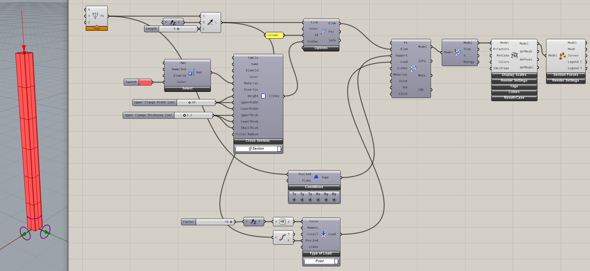
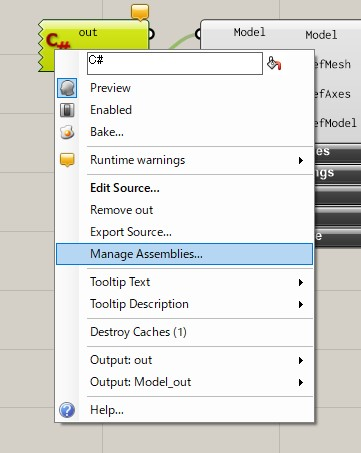
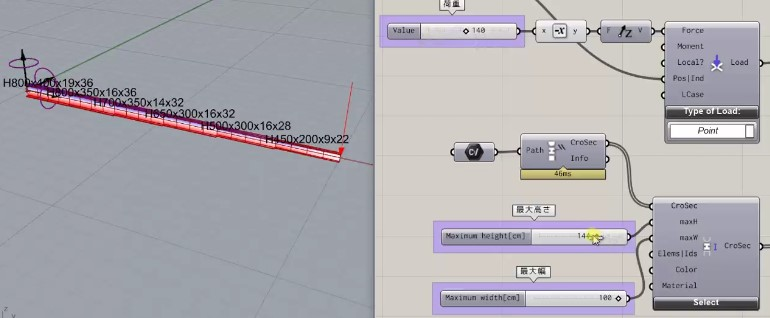

# Day2

2 日目はプログラミング言語の C#の基礎的知識と Grasshopper でのカスタムコンポーネントの作成について紹介します。
Karamba3D はユーロコードを基にしているため、C# を使って Karamba3D をカスタマイズすることにより日本での構造設計に即したパラメトリックな構造解析を可能にします。

## C# の基礎

環境構築がうまくいかないと困るので、以下のブラウザ上でC#を実行できるサービスを使って基礎について振れていきます。

https://dotnetfiddle.net/

まずは Hello World の仕方は以下になります。

<iframe width="100%" height="475" src="https://dotnetfiddle.net/Widget/CsCons" frameborder="0"></iframe>

## Karamba3D のカスタマイズ

//TODO これを作ったのが 1.3.3 のときなので今でも動くか確認する。

カスタマイズで参照する Karamba3d の SDK は以下になります。

https://www.karamba3d.com/help/2-2-0/html/b2fe4d67-e7e2-4f96-bc84-ecd423bde1a7.htm

### 柱の解析

#### Grasshopper でコンポーネントを使ってモデルづくり

最初から Karamba を使ったコーディングをするとわかりづらいので、はじめにコンポーネントを使ってモデリングしていきます。
作るものの条件は以下です。

- 断面形状：角型 30cm x 30cm 板厚 2.2cm
- 材料：鋼材、色を赤にする
- 境界条件：下端固定
- 荷重：上端節点に対して、-Z 方向に 10kN
- 部材長：3m
- 部材の ID：Column

こんな形です。完成したデータは Data フォルダの column_model.gh です。



#### 同じものを C#Script コンポーネントで作る

スクリプトで Karamba を使うためには、KarambaCommon.dll と Karamba.gha を使います。これは Karamba がインストールされたフォルダ内にあります。Karamba はデフォルトだと以下にあります。以下のフォルダには KarambaCommon.dll とは別に Karamba.dll がありますが、こちらは C++で書かれた Karamba3D の構造計算を実際に行っている部分になります。

> C:\Program Files\Rhino7\Plug-ins\Karamba\karambaCommon.dll

これだけだとどんなクラスがあるかわからないので、冒頭で上げた SDK を見ていきます。

基本的にはメソッドへの入力と出力がコンポーネントの入出力ほぼ同じ構成になっています。では先程作ったモデルを KarambaSDK を使って作成していきます。

最初に参照を追加します。C# Script コンポーネントを右クリックして Manage Assemblies... を選択して、その後 Referenced Assemblies の右側の Add から KarambaCommon.dll と Karamba.gha を追加します。



#### C#Script の内容

完成したデータは Data フォルダの column_script.gh です。注意点ですが、以下のコード中でコメントアウトしているように単位がものによってまちまちなので注意してください。

```cs
using System.Drawing;
using Karamba.Utilities;
using Karamba.Geometry;
using Karamba.CrossSections;
using Karamba.Supports;
using Karamba.Loads;

public class Script_Instance : GH_ScriptInstance
{
    private void RunScript(ref object modelOut, ref object maxDisp)
    {
        var logger = new MessageLogger();
        var k3d = new KarambaCommon.Toolkit();

        // karamba用のlineを作成
        // 名前が似ていますが、Point3もLine3のKaramba.Geometryの構造体です。
        var p0 = new Point3(0, 0, 0);
        var p1 = new Point3(0, 0, 5);
        var L0 = new Line3(p0, p1);

        // 材料の作成
        var E = 210000000;  // kN/m2
        var G = 80760000;  // kN/m2
        var gamma = 78.5;  // kN/m3
        var material = new FemMaterial_Isotrop("Steel", "SN400", E, G, G, gamma, 0, 0, Color.Brown);

        // 断面の作成
        double height = 30;  // cm
        double width = 30;
        double thickness = 2.2;
        double fillet = 2.5 * thickness;
        var croSec = new CroSec_Box("Box", "Box", null, null, material, height, width, width, thickness, thickness, thickness, fillet);

        // Beamを作成
        // 入力は、Line、Id、CrossSection
        var nodes = new List<Point3>();
        var elems = k3d.Part.LineToBeam(new List<Line3>(){ L0 }, new List<string>(){ "Column" }, new List<CroSec>(croSec), logger, out nodes);

        // 境界条件の作成
        // 入力は、条件を指定するPoint3と各変位の拘束のBoolean
        var support = k3d.Support.Support(p0, new List<bool>(){ true, true, true, true, true, true });
        var supports = new List<Support>(){ support };

        // 荷重の作成
        // 入力は、条件を指定するPoint3、荷重のベクトル、モーメントのベクトル、荷重ケース
        var pload = k3d.Load.PointLoad(p1, new Vector3(0, 0, -10), new Vector3(), 0);
        var ploads = new List<Load>(){ pload };

        double mass;  // 重量
        Point3 cog;  // 重心
        bool flag;
        string info;
        var model = k3d.Model.AssembleModel(elems, supports, ploads, out info, out mass, out cog, out info, out flag);

        // 解析を実行
        List<double> maxDisps;  // m
        List<double> outG;
        List<double> outComp;
        string message;
        model = k3d.Algorithms.AnalyzeThI(model, out maxDisps, out outG, out outComp, out message);

        Print("max disp: " + maxDisps.Max() * 100);

        modelOut = new Karamba.GHopper.Models.GH_Model(model);
        maxDisp = maxDisps.Max() * 100;
    }
}
```

### 構造解析で形状をいじる

#### 片持ち梁の変更

片持ち梁を作成し、その応力が許容応力以内におさまる最小の断面にするものを作成します。断面は作成した断面リストの中から選択します。



#### 断面リストの作成

断面は Karamba の CrossSectionRangeSelector コンポーネントを使用します。
このコンポーネントが出力する断面のリストから先程の条件を満たす断面サイズを決定するようにプログラムを作成します。
Karamba のデフォルトの断面リストには日本の規格も含んでおり、JIS 規格がベースになっています。
例えばメーカー品の断面を使用する場合は自分で追加できます。
参考として SH と BCP, BCR を追加したものが Data/JP_CrossSectionValues.csv のデータになります。
断面諸元については注意していますが、正確性は補償しないので実務での使用には気を付けてください。
Read CrossSection Table From File コンポーネントでこれを読み込むことができます。

断面リストのフォーマットは以下のようになっています。

| ラベル | country | family | name                | shape | h   | t_web | b_upper | t_upper | b_lower | t_lower | r   | ex  | ey  | ez  | zs  | A     | Ay    | Az   | Iy  | Wy   | Wply | i_y  | Iz  | Wz   | Wplz | i_z  | It   | Wt   | Cw   | alpha_y | alpha_z | alpha_LT | Product |
| ------ | ------- | ------ | ------------------- | ----- | --- | ----- | ------- | ------- | ------- | ------- | --- | --- | --- | --- | --- | ----- | ----- | ---- | --- | ---- | ---- | ---- | --- | ---- | ---- | ---- | ---- | ---- | ---- | ------- | ------- | -------- | ------- |
| 単位   | -       | -      | -                   | -     | mm  | mm    | mm      | mm      | mm      | mm      | mm  | cm  | cm  | cm  | cm  | cm2   | cm2   | cm2  | cm4 | cm3  | cm3  | cm   | cm4 | cm3  | cm3  | cm   | cm4  | cm3  | cm6  | -       | -       | -        | -       |
| 例     | Japan   | H      | H 100 x 100 x 6 x 8 | I     | 100 | 6     | 100     | 8       |         |         | 8   |     |     |     | 5   | 21.59 | 16.55 | 5.04 | 378 | 75.6 | 86.4 | 4.18 | 134 | 26.7 | 41   | 2.49 | 4.91 | 6.14 | 2820 | 0.34    | 0.49    | 0.34     | 3       |

#### C#Script の内容

断面リストの取得に失敗すると Karamba のデフォルトの断面である RO114.3/4 になるので、出力がおかしいと思った場合は確認してください。

```cs
using System.Linq;
using Karamba.Models;
using Karamba.CrossSections;
using Karamba.Elements;
using Karamba.Results;

public class Script_Instance : GH_ScriptInstance
{
    private void RunScript(object modelIn, List<object> croSecsIn, int nIter, int lcInd, ref object modelOut, ref object dispOut)
    {
      // modelIn と croSecIn は object 型として入力されているので、
      // ここで Karamba の型にキャスト
      var model = modelIn as Model;
      var croSecs = new List<CroSec_Beam>(croSecsIn.Count);
      croSecs.AddRange(croSecsIn.Select(item => item as CroSec_Beam));

      var k3d = new KarambaCommon.Toolkit();
      List<double> maxDisp;
      List<double> outG;
      List<double> outComp;
      string message;
      List<List<double>> N;
      List<List<double>> V;
      List<List<double>> M;

      // nIterの分だけ断面の収束計算を行う
      for (int i = 0; i < nIter; i++)
      {
        // 最初に解析を実行
        model = k3d.Algorithms.AnalyzeThI(model, out maxDisp, out outG, out outComp, out message);

        // ここから各要素の応力を取得してそれに対して断面の検討を行う
        for (int elemInd = 0; elemInd < model.elems.Count; elemInd++)
        {
          var beam = model.elems[elemInd] as ModelBeam;
          if (beam == null)
            continue;

          // 要素の応力を取得
          BeamResultantForces.solve(model, new List<string> { elemInd.ToString() }, lcInd, 100, 1, out N, out V, out M);

          // 断面検定
          foreach (var croSec in croSecs)
          {
            beam.crosec = croSec;
            var maxSigma = Math.Abs(N[lcInd][0]) / croSec.A + M[lcInd][0] / croSec.Wely_z_pos;
            if (maxSigma < croSec.material.fy())
            {
              break;  // 断面が許容応力以下になったら断面の変更を終了
            }
          }
        }

        // ここまでの処理で変更した断面を反映させて、解析モデルを再生成
        model.initMaterialCroSecLists();
        model.febmodel = model.buildFEModel();
        // 次のステップへ
      }

      // 最終モデルの確認用に最後の解析実行
      model = k3d.Algorithms.AnalyzeThI(model, out maxDisp, out outG, out outComp, out message);

      // 結果の出力
      dispOut = new GH_Number(maxDisp[lcInd] * 100);
      modelOut = new Karamba.GHopper.Models.GH_Model(model);
    }
}
```
