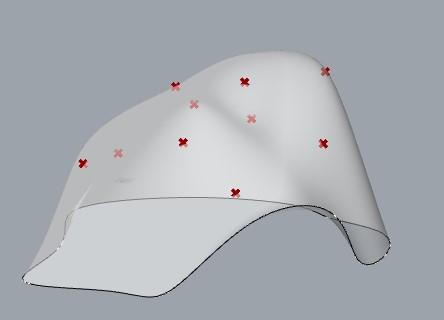
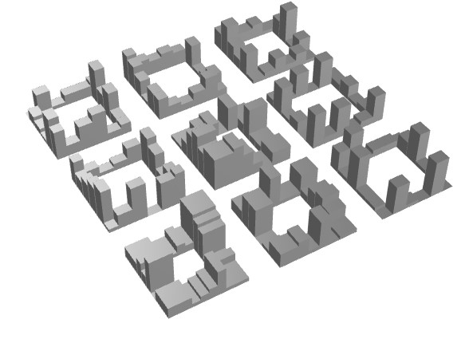
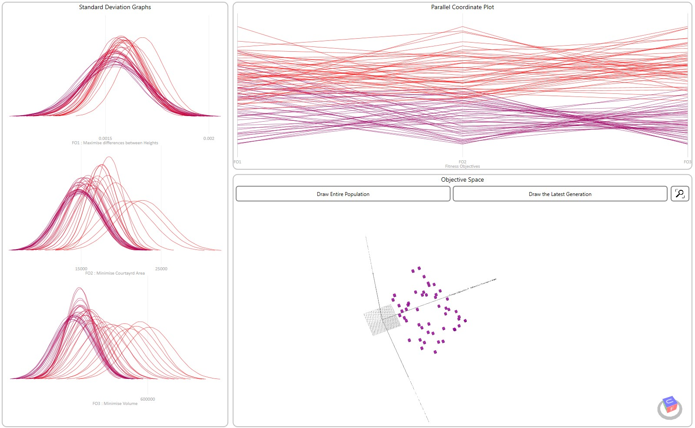
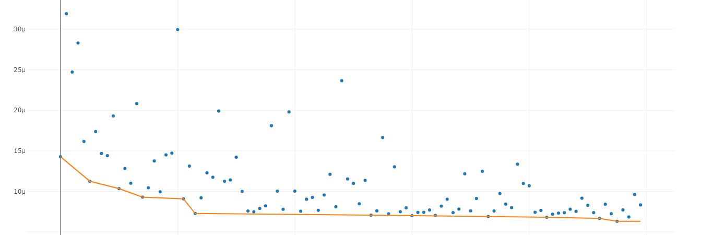
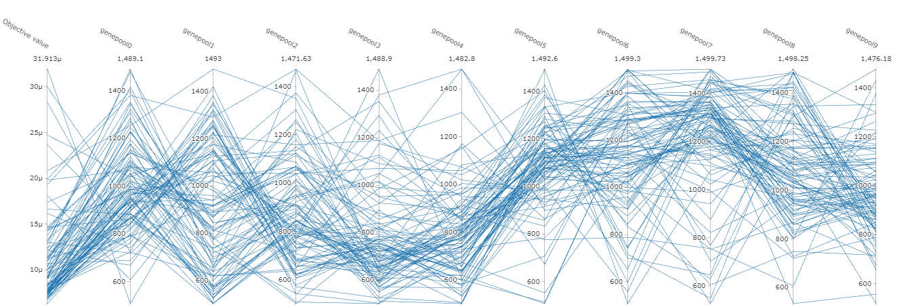
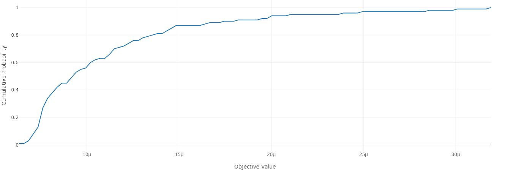
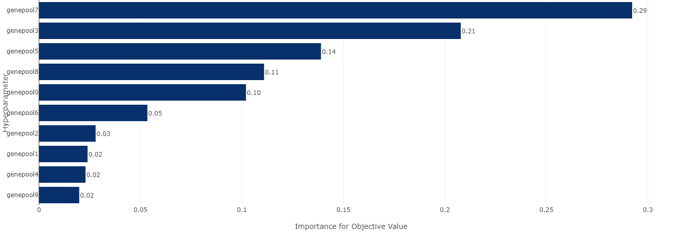
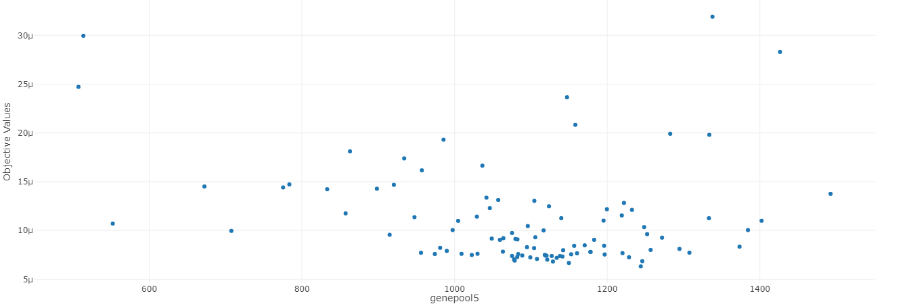
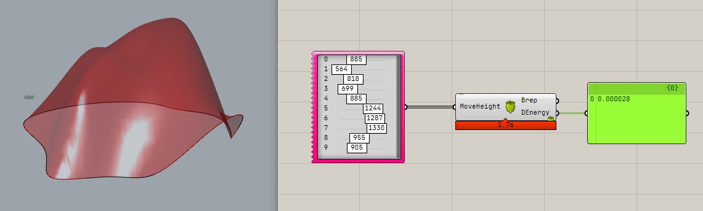

# Day3

3 日目は最適化についての基礎的な内容の紹介と実際に構造最適化を行います。
最適化は Grasshopper 内での既存のツールを使ったものだけでなく、RhinoCompute と Python を使った最適化や応答曲面の作成についても紹介します。

## Grasshopper に既にあるコンポーネントでの最適化

### 構造最適化モデルの作成

Grasshopper を使って構造解析をやるとき大切なのは何をパラメータにするかです。
今回の例では、シェルの形状最適化を行います。

シェルの最適化なので、なにをパラメータに取るべきかを考えたとき、今回はシェルのライズが大きな影響を与えると思われるので、ライズをパラメータに取ります。

作り方はいろいろありますが、今回はサーフェスの境界と各点のライズを決めるポイントを作成してそれらを通る面を作成します。

こうすることでシェルのライズを直接操作することが可能しながら、滑らかな NURBS 曲面を作成することができます。

最適化を実行する前には、可能ならばある程度スライダーなどを操作して、設定しているパラメーター範囲で問題なくモデルが生成されているかを確認してください。

例えば今回は境界条件を節点の座標が 0 以下の点全てに与えています。
モデル形状が変化した時、想定していない部分に境界条件が与えられてしまっていないかなど、自分が期待しない範囲での結果を含んだ最適化を実行することになってしまうと、時間の無駄になってしまうことがあるので注意が必要です。



### 街区モデルの作成

こちらは Wallacei のサンプルモデルを使用します。

Wallacei をダウンロードした時に同梱されている Example Files/Wallacei X/Wallacei X_Example File.gh を使います。

### 簡単なレクチャー

概要をざっくり話します。
多分よくわからないので、以降の実際話す前の参考知識として見てください。

Google slide で話します。

### Galapagos の紹介

Grasshopper でできる最適化が実装されているコンポーネントの多くは、遺伝的アルゴリズム（GA: Genetic Algorithms）を使っています。
今日紹介するものも全て GA が実装されています。

Galapagos は Grasshopper にデフォルトで搭載されている最適化ソルバーです。
機能としては遺伝的アルゴリズムと焼きなまし法による単一目的最適化が搭載されています。

最適化を実行すると解析を流すとだいぶ重いです。
こういった重い最適化は後で紹介する Tunny に実装しているベイズ最適化を実行することをおススメします。

### Wallacei の紹介

上記であげた公式 Example の紹介（街区モデル）を行います。
Galapagos と異なり、多目的最適化ができることが Galapagos と異なる点です。
UI を使ったより詳細な結果の分析ができるので良いです。

最適化問題の結果の考え方として、多目的最適化なのでパレート最適解群がしっかりと得られているかどうかを確認することが大切です。




### Tunny の紹介

Tunny は自分が Wallacei をつかっていて不便に感じた以下の個所を修正したものになっています。

- ジオメトリが保存されない
- 1 個体の評価に時間がかかるものは GA は向かない
  - ベイズ最適化への対応
- 解をより簡単に詳細に検討できるようにしたい
  - Python を使ったフレームワークを取り込むことによって可能にした
- 最適化だけではないデータサイエンスによる結果の考察環境の提供
  - Optuna Dash Board の実装







## RhinoCompute と Python の連携

RhinoInside や Rhino3dm、RhinoCompute など コードから Rhino のデータ、機能を扱う機能は現在色々と提供されています。
言語としては C#、Python、Javascript の 3 つが公式でライブラリが提供されており、いろんな環境で使いやすいように整備されています。

とはいえ、現実問題、普段コードを書いていない人がこういった機能をうまく使うことは難しいです。

その中で、RhinoCompute は Grasshopper から使用するコンポーネントである Hops が公式から提供されており、コードを使うことなく使用することができる機能になっています。

Hops v0.8 のアップデートで Hops で読み込んだ Grasshopper をデータを動かす Python コードを自動生成して出力する機能が追加されました。
これを使うことで Python にあまり慣れていない人でも Grasshopper を コードにように扱い、Python で簡単に Rhino のデータを扱うことができるようになりました。

ここではそのやり方について紹介します。

### RhinoCompute について

公式サイトで RhinoCompute について確認します

- https://developer.rhino3d.com/guides/compute/

### Hops から Python のコードを出力する

PackageManager で Hops をインストールする際には 0.8 以降のバージョンを指定するようにしてください。
最新は 0.15(2022/6/12 時点) です。

ここでは例として以下のように足し算をするコンポーネントを作成します。


Hops で読み込んで上の画像で上げた足し算をする機能を持った Hops コンポーネントが作成します。
値をインプットしたらコンポーネントを右クリックします。
クリックすると以下のようコンテキストメニューが出てくるのでに Export から Export python sample... を選びます。


例えば sum.py と名前をつけてデスクトップに出力先を選択すると今回であれば以下のようなコードが生成されます。

```python
# pip install compute_rhino3d and rhino3dm
import compute_rhino3d.Util
import compute_rhino3d.Grasshopper as gh
import rhino3dm
import json

compute_rhino3d.Util.url = 'http://localhost:6500/'

# create DataTree for each input
input_trees = []
tree = gh.DataTree("A")
tree.Append([0], ["10.0"])
input_trees.append(tree)

tree = gh.DataTree("B")
tree.Append([0], ["5.0"])
input_trees.append(tree)

output = gh.EvaluateDefinition('Path/to/Desktop/sum.gh', input_trees)
errors = output['errors']
if errors:
    print('ERRORS')
    for error in errors:
        print(error)
warnings = output['warnings']
if warnings:
    print('WARNINGS')
    for warning in warnings:
        print(warning)

values = output['values']
for value in values:
    name = value['ParamName']
    inner_tree = value['InnerTree']
    print(name)
    for path in inner_tree:
        print(path)
        values_at_path = inner_tree[path]
        for value_at_path in values_at_path:
            data = value_at_path['data']
            if isinstance(data, str) and 'archive3dm' in data:
                obj = rhino3dm.CommonObject.Decode(json.loads(data))
                print(obj)
            else:
                print(data)
```

### Python で Grasshopper を動かしてみる

では出力されたコードを確認していきましょう。
まず環境に Python がインストールされている必要があります。
もしインストールされていない方は、以下からインストールしてください。

- https://www.python.org/downloads/

なお私の環境では Python 3.9 を使用していますが最新版の 3.10 でも問題なく動くと思われます。
このコードは python のフォルダにある Add.py、または Notebook の場合は ipynb フォルダに入っています。

#### 環境の構築

上記で生成されたコードを見ると最初の行に以下のように書かれています。

```python
# pip install compute_rhino3d and rhino3dm
import compute_rhino3d.Util
import compute_rhino3d.Grasshopper as gh
import rhino3dm
import json
```

冒頭にあるように pip を使って必要なライブラリをインストールします。
pip とは Python のパッケージマネージャーになります。
あまりパッケージマネージャーになじみのない方は例えば Apple の AppStore のように iPhone 使えるアプリがひとまとめになっているサイトのようなものの python 版だと考えてください。
これによって import している各ライブラリが使えるようになります。

```python
pip install compute_rhino3d rhino3dm
```

#### RhinoCompute のサーバーの指定

以下の箇所では、RhinoCompute のサーバーを指定しています。

```python
compute_rhino3d.Util.url = 'http://localhost:6500/'
```

Hops がインストールされている環境では、Grasshopper を起動すると裏で自動で RhinoCompute のサーバーが上記 URL で起動するので、基本的には特に操作する必要はありません。

#### 入力の値を指定

以下の箇所では入力の値を指定しています。

```python
# create DataTree for each input
input_trees = []
tree = gh.DataTree("A")
tree.Append([0], ["10.0"])
input_trees.append(tree)

tree = gh.DataTree("B")
tree.Append([0], ["5.0"])
input_trees.append(tree)
```

`tree = gh.DataTree("A")` の箇所では Hops の A の入力の箇所の値を指定しています。
Export する時の画像を確認していただくと A には 10 の値が入力されていることが分かると思います。
ですので別の計算を行いたかったら、`tree.Append([0], ["10.0"])` の箇所の 10.0 の箇所を変えれば別の結果を得ることができます。

`tree = gh.DataTree("B")` の箇所も A と同様の内容です。

#### 計算の実行

以下の箇所で grasshopper で計算を実行しています。

```python
output = gh.EvaluateDefinition('Path/to/Desktop/sum.gh', input_trees)
```

メソッドの名称からもわかるように grasshopper の ファイル（definition）を評価（Evaluate）しています。

output には計算の実行結果が入っています。

#### 結果の処理

以下の箇所で結果の出力のための処理をしています。

```python
# error を取得
errors = output['errors']
if errors:
    print('ERRORS')
    for error in errors:
        print(error)

# warning を取得
warnings = output['warnings']
if warnings:
    print('WARNINGS')
    for warning in warnings:
        print(warning)

# 結果の値を取得
values = output['values']
for value in values:
    name = value['ParamName']
    inner_tree = value['InnerTree']
    # 出力の名前を出力（例えば RH_OUT:result）
    print(name)
    for path in inner_tree:
        # 結果のデータツリーでのパスを出力
        print(path)
        values_at_path = inner_tree[path]
        for value_at_path in values_at_path:
            data = value_at_path['data']
            # 結果を出力
            if isinstance(data, str) and 'archive3dm' in data:
                obj = rhino3dm.CommonObject.Decode(json.loads(data))
                print(obj)
            else:
                print(data)
```

#### 計算を実行する

pip を使って必要なライブラリをインストールできていれば、以下を実行するればこれらのコードが流れます。

```python
python ./sum.py
```

問題なく処理が実行されると以下のように結果が返ってきます。

```
RH_OUT:result
{0}
15.0
```

今回は出力を RH_OUT:result しか作っていないので結果は一つですが、それぞれの結果の名前、データツリーでのパス、結果を出力することができます。

#### 複数の結果を取得してみる

これでは Grasshopper でそのまま流すことと変わらないので、for 文を使って複数の処理を流してみます。

```python
import compute_rhino3d.Util
import compute_rhino3d.Grasshopper as gh
import rhino3dm
import json

compute_rhino3d.Util.url = 'http://localhost:6500/'

# for 文を追加
for i in range(1,5):
    input_trees = []
    tree = gh.DataTree("A")

    # もともと 10.0 を入力していたが、
    # i を入力することで、for文中で値を変える
    tree.Append([0], [i])
    input_trees.append(tree)

    tree = gh.DataTree("B")
    tree.Append([0], ["5.0"])
    input_trees.append(tree)

    output = gh.EvaluateDefinition('./sum.gh', input_trees)

    # 以降変化なし
```

こちらを実行すると i が 1 から 4 に変化し 4 回計算が流れるので、以下のような結果が返ってきます。
これで少しコードで処理する利点が出たのではないでしょうか。

```
RH_OUT:result
{0}
6.0
RH_OUT:result
{0}
7.0
RH_OUT:result
{0}
8.0
RH_OUT:result
{0}
9.0
```

### Python で最適化を実行する

#### optuna について

Python にはたくさんの最適化ライブラリが存在します。
ここではハイパーパラメータ最適化に使われる Optuna を使います。
Optuna は上で紹介した Tunny の内部で使用しているライブラリでもあります。

- [公式サイト](https://www.preferred.jp/ja/projects/optuna/)

開発は PreferredNetworks という日本の会社で、AI や機械学習などでトップを行くスタートアップです。
GitHub の OSS として開発されており、現在も積極的に開発されていることから Tunny に採用しています。

#### 実行環境の構築

RhinoCompute で Grasshopper を実行する箇所でやったように、pip を使って optuna をインストールします。

```python
pip install optuna, plotly
```

#### optuna での最適化

ここでは GA を使った最適化を行ってみます。optuna の GA は NSGA-II というアルゴリズムで実装されており、以下のような引数を取れます。

- https://optuna.readthedocs.io/en/stable/reference/generated/optuna.samplers.NSGAIISampler.html

Galapagos や他のものと同様に、各世代のサイズ(Population_size) や 突然変異の確率(mutation_prob)、交差の確立(crossover_prob)が取れることがわかります。

簡単な例は以下になります。
この短いコードで GA を実行できます。

```python
import optuna


def objective(trial):
    x = trial.suggest_float('x', -10, 10)
    return (x - 2) ** 2

sampler = optuna.samplers.NSGAIISampler()　# 最適化アルゴリズムの設定
study = optuna.create_study(sampler=sampler)　# 最適化の計算を行うための study を作成
study.optimize(objective, n_trials=100) # 最適化の実行

print("Best param: ", study.best_params)
print("Best value: ", study.best_value)

# Best param:  {'x': 1.999848379506605}
# Best value:  2.2988774017312754e-08
```

GA の詳細の設定をしたい場合は、`sampler = ...` の部分を以下のように設定します。

```python
sampler = optuna.samplers.NSGAIISampler(
    population_size=10,
    mutation_prob=0.1,
    crossover_prob=0.8,
    swapping_prob=0.4,
)
```

結果を可視化する際は、上記コードの最後に以下を追加してください。

```python
vis = optuna.visualization.plot_optimization_history(study)
vis.show()
```

何がグラフ化可能かは、以下のドキュメントを確認してください。

- https://optuna.readthedocs.io/en/stable/reference/visualization/index.html

最適化コンポーネントの Tunny はこの Optuna をラップしているので、他にも Tunny ででできることは全て Optuna でも行うことができます。
なお、Tunny は Optuna の全ての機能をラップしているわけではないので、こうやってコードを使ってやる方がより詳細に設定ができます。

### 連携による最適化

これまでやってきたことを組み合わせることで、Python コード側から Grasshopper を動かし最適化を実行することができるようになります。
Shell の最適化を実行したモデルを使って Python から最適化を実行します。

注意点としては、Rhino 上のデータを参照している場合は、Grasshopper 単体で動作させて結果を評価しているので、 Internalize するようにしてください。
Python から流す前は Hops などを使って RhinoCompute で求める結果が得られるか確認してください。
Hops へのインプットがリストなので、入力は Tree に対応するように設定します。



まず Hops から出力されるサンプルの Python コードを実行すると以下になります。
設定したように求めた Brep のデータと弾性ひずみエネルギーの結果が取得できます。

```python
# pip install compute_rhino3d and rhino3dm
import compute_rhino3d.Util
import compute_rhino3d.Grasshopper as gh
import rhino3dm
import json

compute_rhino3d.Util.url = 'http://localhost:6500/'

# create DataTree for each input
input_trees = []
tree = gh.DataTree("MoveHeight")
tree.Append([{0}], ["885.0", "564.0", "818.0", "699.0", "885.0",
            "1244.0", "1287.0", "1330.0", "955.0", "905.0"])
input_trees.append(tree)

output = gh.EvaluateDefinition('Path/to/ShellOpt.gh', input_trees)
errors = output['errors']
if errors:
    print('ERRORS')
    for error in errors:
        print(error)
warnings = output['warnings']
if warnings:
    print('WARNINGS')
    for warning in warnings:
        print(warning)

values = output['values']
for value in values:
    name = value['ParamName']
    inner_tree = value['InnerTree']
    print(name)
    for path in inner_tree:
        print(path)
        values_at_path = inner_tree[path]
        for value_at_path in values_at_path:
            data = value_at_path['data']
            if isinstance(data, str) and 'archive3dm' in data:
                obj = rhino3dm.CommonObject.Decode(json.loads(data))
                print(obj)
            else:
                print(data)

# 結果
# RH_OUT:Brep
# {0;0;0}
# <rhino3dm._rhino3dm.Brep object at 0x000002DE8FD7F5B0>
# RH_OUT:DEnergy
# {0;0;0;0;0;0}
# 2.7562663688079203E-05
```

上記を Optuna から最適化が実行できるように書き換えていきます。
上では NSGA-II を使った例を出しましたが、別の例としてベイズ最適化を使用した TPE アルゴリズムで実行した場合を示しています。

今回の Shell の最適化のような処理が重い場合はベイズ最適化を使用することをおススメします。
ただしベイズ最適化は変数が多い場合が得意ではないため、入力する変数の数によって選択する必要があります。
各アルゴリズムでの計算コストは以下です。
必ずしも理解する必要はありませんが、アルゴリズムを決定する一要因として頭に入れておくとよいでしょう。

- Random: $O(d)$
- TPE: $O(dn \log{n})$
- NSGA-II: $O(mnp)$

d は探索空間の次元（＝変数の数）、n は完了したトライアルの数、ｍ は目的関数の数、p はポピュレーションサイズです。

https://optuna.readthedocs.io/en/latest/reference/samplers/index.html

TPE でわかりやすい注意すべき点は、n_startup_trials の値です。
この値になるまではランダムサンプリングが行われます。
ランダムサンプリングは名称の通りランダムに次の値を決定しており、最小化などを行っていないサンプリングです。

元論文では、`変数の数 × 11 - 1` が推奨されています。
今回やる Shell の最適化では変数が 10 個あるので、109 が推奨値になりますが、100 トライアルで終了させたいのでここでは 50 を n_startup_trials にしています。

作成したコードは以下です。

```python
import compute_rhino3d.Util
import compute_rhino3d.Grasshopper as gh
import rhino3dm
import json
import sys
import optuna

compute_rhino3d.Util.url = 'http://localhost:6500/'


def objective(trial):
    variables = []
    result = sys.float_info.max

    for i in range(10):
        variables.append(trial.suggest_uniform('genepool' + str(i), -10, 10))

    return float(run_gh(variables)[1])


def run_gh(variables):
    result = []

    input_trees = []
    tree = gh.DataTree("MoveHeight")
    tree.Append([{0}], variables)
    input_trees.append(tree)

    output = gh.EvaluateDefinition('Path\\to\\ShellOpt.gh', input_trees)
    errors = output['errors']
    if errors:
        print('ERRORS')
        for error in errors:
            print(error)
    warnings = output['warnings']
    if warnings:
        print('WARNINGS')
        for warning in warnings:
            print(warning)

    values = output['values']
    for value in values:
        name = value['ParamName']
        inner_tree = value['InnerTree']
        for path in inner_tree:
            values_at_path = inner_tree[path]
            for value_at_path in values_at_path:
                data = value_at_path['data']
                if isinstance(data, str) and 'archive3dm' in data:
                    obj = rhino3dm.CommonObject.Decode(json.loads(data))
                    result.append(obj)
                else:
                    result.append(data)

    return result 


if __name__ == "__main__":
    sampler = optuna.samplers.TPESampler(
        n_startup_trials=50,
    )
    study = optuna.create_study(sampler=sampler)
    study.optimize(objective, n_trials=100)

    print("Best param: ", study.best_params)
    print("Best value: ", study.best_value)

    vis = optuna.visualization.plot_optimization_history(study)
    vis.show()


# 結果 ランダムが含まれているので人によって違う結果が出ていると思います。
# Best param:  {'x0': -9.461240796930394, 'x1': 7.822585899093222, 'x2': -0.5868857354926643, 'x3': 8.104354176505808, 'x4': 7.543290616830272, 'x5': 5.58636025609701, 'x6': -1.5275891437210767, 'x7': 4.274577664251453, 'x8': -5.97323876201837, 'x9': -1.8097953095751154}
# Best value:  0.0001080773215339902

```

### Deep Dive

今回は最適化の例をやったため、Grasshopper 上で最適化コンポーネントを使った際とやっていることは大きく変わりません。
Python にはデータサイエンスや機械学習のライブラリがあり、近年ではこれらを使ってより効率的に解を取得する方法が行われています。
例えば KPF の以下の取り組みがあります。

- [Bridging Data Science and Architectural Practice](https://medium.com/@kpfui/bridging-data-science-and-architectural-practice-aceb3f23fd95)

プログラムを使った RhinoCompute と Grasshopper の連携そのものへの理解をより深めたい方は、公式でサポートされていないプログラム言語である Rust から RhinoCompute を実行する方法を以下の記事で紹介しているので、こちらの記事を読んでいただくと参考になります。

- [Deep dive into RhinoCompute through Rust](https://hiron.dev/articles/deep-dive-into-rhinocompute-through-rust)

## 質疑応答コーナー

本日の内容は以上です。
質疑などありますか？
